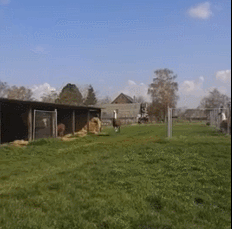

<!-- .element: class="x" -->

<pre style="box-shadow: none; font-weight: bold; padding: 0 20%;">
  ^__^
  (oo)\_______
  (__)\       )\/\
      ||----w |
      ||     ||
</pre>

### -name: The Power of Callback Plugins
#### hosts: AnsibleFest San Francisco 2017
#### vars:
#### &nbsp;&nbsp;presenter: Chris Church
#### <!-- .element: class="fragment" -->tasks: ...

Note:
Do I need a note?

+++

### -name: Who Dis?
#### set_fact:
#### <!-- .element: class="fragment" -->&nbsp;&nbsp;`tower_api_developer`: >   &nbsp;&nbsp;&nbsp;&nbsp;[Since March 2013](https://github.com/ansible/awx/commit/a61a3538291812de5032bc383e662c000e33741e)
#### <!-- .element: class="fragment" -->&nbsp;&nbsp;`tower_callback_plugin`: >   &nbsp;&nbsp;&nbsp;&nbsp;[~90% of current implementation](https://github.com/ansible/awx/blame/c7a85d9738a1e7ddd52a65968766800ed8c34d12/awx/lib/tower_display_callback/module.py)
#### <!-- .element: class="fragment" -->&nbsp;&nbsp;`ansible_winning: >`   &nbsp;&nbsp;&nbsp;&nbsp;[github.com/cchurch/ansible-winning](https://github.com/cchurch/ansible-winning)
#### <!-- .element: class="fragment" -->&nbsp;&nbsp;`ansible_sign: >`   &nbsp;&nbsp;&nbsp;&nbsp;[github.com/cchurch/ansible-sign](https://github.com/cchurch/ansible-sign)

Note:

---

### -name: What *IS* a Callback Plugin?
#### hosts: Ansible Core
#### tasks: ...

+++

### -name: One of Many Plugins
#### command: > &nbsp;&nbsp;find -type d lib/ansible/plugins/

<pre class="fragment current-visible" style="position: absolute;"><code class="ini">action
cache
callback
connection
filter
lookup
shell
strategy
terminal
test
vars
</code></pre>

Also Plugins:

<ul>
  <li>modules</li>
  <li>module_utils</li>
  <li>module_doc_fragments</li>
</ul>

More in 2.4:

<ul>
  <li>cliconf</li>
  <li>inventory</li>
  <li>netconf</li>
</ul>

+++

### -name: CallbackBase
#### debug: &nbsp;&nbsp;var: ansible.plugins.callback.CallbackBase

<pre class="fragment"><code class="python hljs">class CallbackBase:

    CALLBACK_VERSION = '2.0'
    CALLBACK_TYPE = 'notification'
    CALLBACK_NAME = 'myplugin'
    CALLBACK_NEEDS_WHITELIST = True

</code><code class="fragment python hljs">    def v2_on_any(self, *args, **kwargs):
        pass
</code></pre>

+++

### -name: CALLBACK_TYPE
#### debug: &nbsp;&nbsp;var: CallbackBase.CALLBACK_TYPE

<ul class="fragment" style="margin-top: 1em;">
  <li><b>stdout</b>: Only one</li>
  <li><b>notification</b>: Zero or more, may be whitelisted</li>
  <li><b>aggregate</b>: Zero or more, may be whitelisted</li>
</ul>

+++

### -name: Built-In Callbacks
#### command: > &nbsp;&nbsp;ls lib/ansible/plugins/callback/*.py

Stdout:

<pre><code class="ini">default (ansible-playbook)
minimal (ansible, ansible-console)
actionable
debug
dense
fullskip
json
oneline
selective
skippy
stderr
</code></pre>

Notification:

<pre><code class="ini">foreman
hipchat
jabber
log_plays
logentries
mail
osx_say
slack
</code></pre>

Aggregate:

<pre><code class="ini">context_demo
junit
logstash
profile_roles
profile_tasks
syslog_json
timer
tree
</code></pre>

+++

### -name: Bring Your Own
#### debug: var=callback_plugins

Playbooks and Roles:

<pre><code class="jinja">{{playbook_dir}}/callback_plugins
{{role_dir}}/callback_plugins
</code></pre>

ANSIBLE_CALLBACK_PLUGINS or ansible.cfg:

<pre><code class="ini">[defaults]
callback_plugins=~/.ansible/plugins/callback:/usr/share/ansible/plugins/callback
</code></pre>

+++

### -name: Loaded When?
#### debug: msg='Callback Loaded' when: CALLBACK_TYPE == 'stdout'

ANSIBLE_STDOUT_CALLBACK or ansible.cfg:

<pre><code class="ini">[defaults]
stdout_callback=default
</code></pre>

<h4>-debug: msg='Callback Loaded' when: CALLBACK_TYPE != 'stdout'</h4>

CALLBACK_NEEDS_WHITELIST == False or ANSIBLE_CALLBACK_WHITELIST or ansible.cfg:

<pre><code class="ini">[defaults]
callback_whitelist=timer,tree
</code></pre>

---

### -name: Playbooks, Plays & Tasks
#### hosts: Demo Callback Plugin
#### tasks: ...

+++

### -name: Per Playbook
#### `debug: var=v2_playbook_on_start`

<pre><code class="python">def v2_playbook_on_start(self, playbook):
    self.playbook = playbook
    filename = getattr(playbook, '_file_name', '???')
    plays = playbook.get_plays()
</code></pre>

<h4>-debug: var=playbook</h4>
<pre><code class="nohighlight">&lt;ansible.playbook.Playbook object&gt;
</code></pre>

<h4>-debug: var=playbook_stdout (-vv)</h4>
<pre><code class="nohighlight">PLAYBOOK: demo.yml &#42;&#42;&#42;&#42;&#42;&#42;&#42;&#42;&#42;&#42;&#42;&#42;
1 plays in demo.yml
</code></pre>

+++

### -name: Prompts
#### debug: > &nbsp;&nbsp;var=`v2_playbook_on_vars_prompt`

<pre><code class="python">def v2_playbook_on_vars_prompt(self,
                               varname,
                               private=True,
                               prompt=None,
                               encrypt=None,
                               confirm=False,
                               salt_size=None,
                               salt=None,
                               default=None):
    pass
</code></pre>

<h4>-set_fact: &nbsp;&nbsp;called_before: display.do_var_prompt &nbsp;&nbsp;return_value: ignored &nbsp;&nbsp;override_possible: not really</h4>

+++

### -name: Includes*
#### debug: var=v2_playbook_on_include

<pre><code class="python">def v2_playbook_on_include(self, included_file):
    filename = included_file._filename
    args = included_file._args
    task = included_file._task
    hosts = included_file._hosts
</code></pre>

<h4>-debug: var=included_file</h4>
<pre><code class="nohighlight">&lt;ansible.playbook.IncludedFile object&gt;
</code></pre>

<h4>-debug: var=include_stdout</h4>
<pre><code class="nohighlight">included: file.yml for host</code></pre>

<h4>-set_fact: actually_called=rarely*</h4>

+++

### -name: Per Play
#### debug: > &nbsp;&nbsp;var=v2_playbook_on_play_start

<pre><code class="python">def v2_playbook_on_play_start(self, play):
    playbook = self.playbook
    self.play = play
    if isinstance(play.hosts, list):
        pattern = ','.join(play.hosts)
    else:
        pattern = play.hosts
    name = play.get_name().strip() or pattern
    uuid = str(play._uuid)
</code></pre>

<h4>-debug: var=play</h4>
<pre><code class="nohighlight">&lt;ansible.playbook.Play object&gt;
</code></pre>

<h4>-debug: var=play_stdout</h4>
<pre><code class="nohighlight">PLAY [my play] &#42;&#42;&#42;&#42;&#42;&#42;&#42;&#42;&#42;&#42;&#42;&#42;</code></pre>

+++

### -name: Per Task
#### debug: > &nbsp;&nbsp;var=v2_playbook_on_task_start

<pre><code class="python">def v2_playbook_on_task_start(self, task, is_conditional):
    playbook, play = self.playbook, self.play
    self.task = task
    name, action = task.name or task.get_name(), task.action
    path = task.get_path()
    no_log = task.no_log
    role = task._role._role_name if task._role else None
    uuid = str(task._uuid)
</code></pre>

<h4>-debug: var=task</h4>
<pre><code class="nohighlight">&lt;ansible.playbook.Task object&gt;
</code></pre>

<h4>-debug: var=task_stdout (-vv)</h4>
<pre><code class="nohighlight">TASK [my task] &#42;&#42;&#42;&#42;&#42;&#42;&#42;&#42;&#42;&#42;&#42;&#42;
task path: demo.yml:9</code></pre>

+++

### -name: Handlers
#### debug: > &nbsp;&nbsp;var=`v2_playbook_on_handler_task_start`

<pre><code class="python">def v2_playbook_on_handler_task_start(self, task):
    self.v2_playbook_on_task_start(task, is_conditional=True)
</code></pre>

<h4>-debug: var=handler_task_stdout (-vv)</h4>
<pre><code class="nohighlight">RUNNING HANDLER [my handler] &#42;&#42;&#42;&#42;&#42;&#42;&#42;&#42;&#42;&#42;&#42;&#42;</code></pre>

+++

### -name: No Hosts Matched
#### debug: >  &nbsp;&nbsp;var=`v2_playbook_on_no_hosts_matched`

<pre><code class="python">def v2_playbook_on_no_hosts_matched(self):
    playbook, play = self.playbook, self.play
</code></pre>

<h4>-debug: var=no_hosts_matched_stdout</h4>
<pre><code class="nohighlight">skipping: no hosts matched</code></pre>

+++

### -name: No Hosts Remaining
#### debug: > &nbsp;&nbsp;var=v2_playbook_on_no_hosts_remaining

<pre><code class="python">def v2_playbook_on_no_hosts_remaining(self):
    playbook, play = self.playbook, self.play
</code></pre>

<h4>-debug: var=no_hosts_remaining_stdout</h4>
<pre><code class="nohighlight">NO MORE HOSTS LEFT &#42;&#42;&#42;&#42;&#42;&#42;&#42;&#42;&#42;&#42;&#42;&#42;</code></pre>

+++

### -name: Stats
#### debug: var=v2_playbook_on_stats

<pre><code class="python">def v2_playbook_on_stats(self, stats):
    playbook = self.playbook
    changed = stats.changed
    dark = stats.dark
    failures = stats.failures
    ok = stats.ok
    processed = stats.processed
    skipped = stats.skipped
    custom = getattr(stats, 'custom', {})
</code></pre>

<h4>-debug: var=stats.ok</h4>
<pre><code class="python">{'host': 22}
</code></pre>

<h4>-debug: var=stats_stdout</h4>
<pre><code class="nohighlight">PLAY RECAP &#42;&#42;&#42;&#42;&#42;&#42;&#42;&#42;&#42;&#42;&#42;&#42;
host    : ok=22    changed=4    unreachable=0    failed=0
</code></pre>

+++

### -name: Never Called
#### debug: var={{item}} when: false `with_items`: &nbsp;&nbsp;-&nbsp;`v2_playbook_on_notify` &nbsp;&nbsp;-&nbsp;`v2_playbook_on_cleanup_task_start`

---

### -name: Runner Events
#### hosts: Demo Callback Plugin
#### tasks: ...

+++

### -name: OK
#### debug: var=`v2_runner_on_ok`

<pre><code class="python">def v2_runner_on_ok(self, result):
    playbook, play, task = self.playbook, self.play, self.task
    host = result._host
    hostname = result._host.get_name()
    remote_addr = result._host.address
    res = result._result
    event_loop = result._task.loop if hasattr(result._task, 'loop') else None
</code></pre>

<h4>-debug: var=ok_stdout (-vv)</h4>
<pre><code class="nohighlight">ok: [host] => {"changed": false, "cmd": ["uptime"], "delta": "0:00:00.011449", "end": "2017-09-07 02:43:31.610607", "rc": 0, "start": "2017-09-07 02:43:31.599158", "stderr": "", "stderr_lines": [], "stdout": " 2:43  up 5 days, 11:19, 7 users, load averages: 1.98 1.89 1.94", "stdout_lines": [" 2:43  up 5 days, 11:19, 7 users, load averages: 1.98 1.89 1.94"]}
</code></pre>

<h4>-debug: var=ok_task</h4>
<pre><code class="yaml">- command: uptime
  changed_when: false
</code></pre>

+++

### -name: OK
#### debug: var=`result`

<pre><code class="nohighlight">&lt;ansible.executor.task_result.TaskResult object&gt;</code></pre>

<h4>-debug: var=result._result</h4>
<pre><code class="json">{
    "_ansible_no_log": false,
    "_ansible_parsed": true,
    "changed": false,
    "cmd": [
        "uptime"
    ],
    "delta": "0:00:00.014762",
    "end": "2017-09-07 02:53:26.721913",
    "invocation": {
        "module_args": {
            "_raw_params": "uptime",
            "_uses_shell": false,
            "chdir": null,
            "creates": null,
            "executable": null,
            "removes": null,
            "warn": true
        }
    },
    "rc": 0,
    "start": "2017-09-07 02:53:26.707151",
    "stderr": "",
    "stderr_lines": [],
    "stdout": " 2:53  up 5 days, 11:29, 7 users, load averages: 2.33 2.33 2.15",
    "stdout_lines": [
        " 2:53  up 5 days, 11:29, 7 users, load averages: 2.33 2.33 2.15"
    ]
}
</code></pre>

+++

### -name: Failed
#### debug: var=`v2_runner_on_failed`

<pre><code class="python">def v2_runner_on_failed(self, result, ignore_errors=False):
    playbook, play, task = self.playbook, self.play, self.task
    ...
</code></pre>

<h4>-debug: var=failed_stdout (-vv)</h4>
<pre><code class="nohighlight">fatal: [me]: FAILED! => {"changed": false, "failed": true, "failed_when_result": true, "ping": "pong"}
...ignoring
</code></pre>

<h4>-debug: var=failed_task</h4>
<pre><code class="yaml">- action: ping
  failed_when: true
  ignore_errors: true
</code></pre>

+++

### -name: Skipped
#### debug: var=`v2_runner_on_skipped`

<pre><code class="python">def v2_runner_on_skipped(self, result):
    playbook, play, task = self.playbook, self.play, self.task
    skip_reason = result._result.get('skip_reason')
    ...
</code></pre>

<h4>-debug: var=skipped_stdout (-vv)</h4>
<pre><code class="nohighlight">skipping: [host] => {"changed": false, "skip_reason": "Conditional result was False", "skipped": true}
</code></pre>

<h4>-debug: var=skipped_task</h4>
<pre><code class="yaml">- action: ping
  when: false
</code></pre>

+++

### -name: Unreachable
#### debug: var=`v2_runner_on_unreachable`

<pre><code class="python">def v2_runner_on_unreachable(self, result):
    playbook, play, task = self.playbook, self.play, self.task
    msg = result._result.get('msg')
    ...
</code></pre>

<h4>-debug: var=skipped_stdout (-vv)</h4>
<pre><code class="nohighlight">fatal: [host]: UNREACHABLE! => {"changed": false, "msg": "Failed to connect to the host via ssh: ssh: connect to host 127.0.0.1 port 22: Connection refused\r\n", "unreachable": true}
</code></pre>

+++

### -name: Item OK
#### debug: var=`v2_runner_item_on_ok`

<pre><code class="python">def v2_runner_item_on_ok(self, result):
    playbook, play, task = self.playbook, self.play, self.task
    item = result._result.get('item')
    ...
</code></pre>

<h4>-debug: var=item_ok_stdout (-vv)</h4>
<pre><code class="nohighlight">changed: [host] => (item=True) => {"changed": true, "cmd": ["echo", "True"], "delta": "0:00:00.009627", "end": "2017-09-07 09:01:25.905027", "item": true, "rc": 0, "start": "2017-09-07 09:01:25.895400", "stderr": "", "stderr_lines": [], "stdout": "True", "stdout_lines": ["True"]}
</code></pre>

<h4>-debug: var=item_ok_task</h4>
<pre><code class="yaml">- debug: msg='{{item}}'
  with_items: [one, two, three]
</code></pre>

+++

### -name: Item Failed
#### debug: var=`v2_runner_item_on_failed`

<pre><code class="python">def v2_runner_item_on_failed(self, result):
    playbook, play, task = self.playbook, self.play, self.task
    item = result._result.get('item')
    ...
</code></pre>

<h4>-debug: var=item_failed_stdout (-vv)</h4>
<pre><code class="nohighlight">failed: [host] (item=one) => {"failed": true, "failed_when_result": true, "item": "one", "msg": "one"}
</code></pre>

<h4>-debug: var=item_failed_task</h4>
<pre><code class="yaml">- debug: msg='{{item}}'
  with_items: [one, two, three]
  failed_when: true
  ignore_errors: true
</code></pre>

+++

### -name: Item Skipped
#### debug: var=`v2_runner_item_on_skipped`

<pre><code class="python">def v2_runner_item_on_skipped(self, result):
    playbook, play, task = self.playbook, self.play, self.task
    item = result._result.get('item')
    ...
</code></pre>

<h4>-debug: var=item_skipped_stdout (-vv)</h4>
<pre><code class="nohighlight">skipping: [host] => (item=one) => {"changed": false, "item": "one", "skip_reason": "Conditional result was False", "skipped": true}
</code></pre>

<h4>-debug: var=item_skipped_task</h4>
<pre><code class="yaml">- debug: msg='{{item}}'
  with_items: [one, two, three]
  when: false
</code></pre>

+++

### -name: File Diff
#### debug: var=`v2_on_file_diff`

<pre><code class="python">def v2_on_file_diff(self, result):
    playbook, play, task = self.playbook, self.play, self.task
    diff = result._result.get('diff') or {}
    before_header = diff.get('before_header', '')
    before = diff.get('before', '')
    after_header = diff.get('after_header', '')
    after = diff.get('after', '')
    ...
</code></pre>

<h4>-debug: var=diff_stdout (-vv)</h4>
<pre><code class="nohighlight">--- before: /tmp/myself
+++ after: /var/folders/d9/6l0j02nx09g5h05pjgbphvqh0000gn/T/tmpLzY3YX
@@ -1 +1 @@
-Thu Sep  7 09:59:50 PDT 2017
+Thu Sep  7 10:00:11 PDT 2017
</code></pre>

+++

### -name: File Diff
#### debug: var=`diff_task`

<pre><code class="yaml">- copy:
    content: '{{lookup("pipe", "date")}}'
    dest: '/tmp/{{inventory_hostname}}'
</code></pre>

--diff or ANSIBLE_DIFF_ALWAYS or ansible.cfg:

<pre><code class="ini">[diff]
always=true
</code></pre>

+++

### -name: Retry
#### debug: var=`v2_runner_on_retry`

<pre><code class="python">def v2_runner_on_retry(self, result):
    playbook, play, task = self.playbook, self.play, self.task
    retries = result._result.get('retries')
    attempts = result._result.get('attempts')
    ...
</code></pre>

<h4>-debug: var=retry_stdout (-vv)</h4>
<pre><code class="nohighlight">FAILED - RETRYING: my task (99 retries left).
</code></pre>

<h4>-debug: var=retry_task</h4>
<pre><code class="yaml">- shell: echo $(((RANDOM % 10) + 1))
  register: random_result
  until: random_result.stdout == "1"
  retries: 99
  delay: 1
</code></pre>

+++

### -name: Never Called
#### debug: var={{item}} when: false `with_items`: &nbsp;&nbsp;-&nbsp;`v2_runner_on_async_poll` &nbsp;&nbsp;-&nbsp;`v2_runner_on_async_ok` &nbsp;&nbsp;-&nbsp;`v2_runner_on_async_failed` &nbsp;&nbsp;-&nbsp;`v2_runner_on_file_diff` &nbsp;&nbsp;-&nbsp;`v2_runner_on_no_hosts`

---

### -name: What About?
#### hosts: Demo Callback Plugin
#### tasks: ...

+++

### -name: Capturing Stdout
#### debug: var=capture_event_data

<pre><code class="python">with self.capture_event_data('v2_runner_on_ok', **event_data):
    super(CallbackModule, self).v2_runner_on_ok(result)
</code></pre>

<h4>-debug: var=mark_begin</h4>
<pre><code class="python">def mark_begin(fileobj, event_uuid):
    b64data = base64.b64encode(json.dumps({'uuid': event_uuid}))
    fileobj.write(u'\x1b[K{}\x1b[{}D\x1b[K'.format(b64data, len(b64data)))
</code></pre>

<h4>-debug: var=mark_end</h4>
<pre><code class="python">def mark_end(fileobj):
    b64data = base64.b64encode(json.dumps({}))
    fileobj.write(u'\x1b[K{}\x1b[{}D\x1b[K'.format(b64data, len(b64data)))
</code></pre>

+++

### -name: Capturing Stdout
#### debug: > &nbsp;&nbsp;var=ansible.utils.display.Display

<pre><code class="python">class Display:

    def display(self, msg, color=None, stderr=False, screen_only=False, log_only=False):
        ...

    def verbose(self, msg, host=None, caplevel=2):
        ...

    def banner(self, msg, color=None, cows=True):
        ...
</code></pre>

+++

### -name: My ⨍®𝒾¢₭ℹ︎ℵ§ Passwords
#### debug: var=task.no_log

<pre><code class="python">if task.no_log:
    task_args = 'NO LOG'
else:
    task_args = ', '.join(('%s=%s' % a for a in task.args.items()))
</code></pre>

<h4>-debug: var=_ansible_no_log</h4>
<pre><code class="python">if res.get('_ansible_no_log', False):
    res = {'censored': 'CENSORED'}
if res.get('results', []):
    res['results'] = copy(res['results'])
for i, item in enumerate(res.get('results', [])):
    if isinstance(item, dict) and item.get('_ansible_no_log', False):
        res['results'][i] = {'censored': 'CENSORED'}
</code></pre>

+++

### -name: Callback Exceptions

ANSIBLE_DEBUG or ansible.cfg:

<pre><code class="ini">[defaults]
debug=true
</code></pre>

---

### -name: How Tower Runs a Job
#### hosts: Ansible Tower
#### tasks: ...

+++

### -name: Playbook Options
#### command: ansible-playbook --help

<pre class="fragment" style="font-size: 0.4em; margin-top: 5em;"><code class="console">
Usage: ansible-playbook playbook.yml

Options:
  --ask-become-pass     ask for privilege escalation password
  -k, --ask-pass        ask for SSH password
  --ask-su-pass         ask for su password (deprecated, use become)
  -K, --ask-sudo-pass   ask for sudo password (deprecated, use become)
  --ask-vault-pass      ask for vault password
  -b, --become          run operations with become (nopasswd implied)
  --become-method=BECOME_METHOD
                        privilege escalation method to use (default=sudo),
                        valid choices: [ sudo | su | pbrun | pfexec | runas ]
  --become-user=BECOME_USER
                        run operations as this user (default=None)
  -C, --check           don't make any changes; instead, try to predict some
                        of the changes that may occur
  -c CONNECTION, --connection=CONNECTION
                        connection type to use (default=smart)
  -D, --diff            when changing (small) files and templates, show the
                        differences in those files; works great with --check
  -e EXTRA_VARS, --extra-vars=EXTRA_VARS
                        set additional variables as key=value or YAML/JSON
  --flush-cache         clear the fact cache
  --force-handlers      run handlers even if a task fails
  -f FORKS, --forks=FORKS
                        specify number of parallel processes to use
                        (default=5)
  -h, --help            show this help message and exit
  -i INVENTORY, --inventory-file=INVENTORY
                        specify inventory host file
                        (default=/etc/ansible/hosts)
  -l SUBSET, --limit=SUBSET
                        further limit selected hosts to an additional pattern
  --list-hosts          outputs a list of matching hosts; does not execute
                        anything else
  --list-tags           list all available tags
  --list-tasks          list all tasks that would be executed
  -M MODULE_PATH, --module-path=MODULE_PATH
                        specify path(s) to module library (default=None)
  --private-key=PRIVATE_KEY_FILE
                        use this file to authenticate the connection
  --skip-tags=SKIP_TAGS
                        only run plays and tasks whose tags do not match these
                        values
  --start-at-task=START_AT
                        start the playbook at the task matching this name
  --step                one-step-at-a-time: confirm each task before running
  -S, --su              run operations with su (deprecated, use become)
  -R SU_USER, --su-user=SU_USER
                        run operations with su as this user (default=root)
                        (deprecated, use become)
  -s, --sudo            run operations with sudo (nopasswd) (deprecated, use
                        become)
  -U SUDO_USER, --sudo-user=SUDO_USER
                        desired sudo user (default=root) (deprecated, use
                        become)
  --syntax-check        perform a syntax check on the playbook, but do not
                        execute it
  -t TAGS, --tags=TAGS  only run plays and tasks tagged with these values
  -T TIMEOUT, --timeout=TIMEOUT
                        override the SSH timeout in seconds (default=10)
  -u REMOTE_USER, --user=REMOTE_USER
                        connect as this user (default=chris)
  --vault-password-file=VAULT_PASSWORD_FILE
                        vault password file
  -v, --verbose         verbose mode (-vvv for more, -vvvv to enable
                        connection debugging)
  --version             show program's version number and exit
</code></pre>

+++

### -name: Job Templates API
#### `get_url`:  &nbsp;&nbsp;url: [tower/api/v1/job_templates/N/](https://tower/api/v1/job_templates/1/)

<iframe class="fragment" src="https://localhost:8043/api/v1/job_templates/5/"></iframe>

+++

### -name: Job Templates UI
#### `get_url`:  &nbsp;&nbsp;url: [tower/#/templates/job_template/N](https://tower/#/templates/job_template/1)

<iframe class="fragment" src="https://localhost:8043/#/templates/job_template/5"></iframe>

+++

### -name: Launch a Job
#### `get_url`:  &nbsp;&nbsp;url: [tower/#/jobs/N](https://tower/#/jobs/1)

<iframe class="fragment" src="https://localhost:8043/#/templates?template_search=id__icontains_DEFAULT:5"></iframe>

+++

### -name: Jobs API
#### `get_url`:  &nbsp;&nbsp;url: [tower/api/v1/jobs/N/](https://tower/api/v1/jobs/1/)

<iframe class="fragment" src="https://localhost:8043/api/v1/jobs/?order_by=-id"></iframe>

+++

### -name: Job Events API
#### `get_url`:  &nbsp;&nbsp;url: [tower/api/v1/jobs/N/job_events/](https://tower/api/v1/jobs/1/job_events/)

<iframe class="fragment" src="https://localhost:8043/api/v1/jobs/?order_by=-id"></iframe>

---

### -name: What Next?
#### hosts: You
#### tasks: ...

+++

### -name: AWX
#### get_url: &nbsp;&nbsp;url: [github.com/ansible/awx](https://github.com/ansible/awx)

#### <!-- .element: class="fragment" -->-set_fact: &nbsp;&nbsp;google_group: [awx-project](https://groups.google.com/d/forum/awx-project) &nbsp;&nbsp;freenode_irc: [ansible-awx](irc://irc.freenode.net/ansible-awx)

+++

### -name: FIXME
#### command: > &nbsp;&nbsp;grep -hir fixme &nbsp;&nbsp;awx/lib/awx_display_callback/

<pre class="fragment" style="margin-top: 2em;"><code class="python"># FIXME: Task is "global" unless using free strategy!
# FIXME: Flag task path output as vv.
# FIXME: When this task UUID repeats, it means the play is using the free strategy...
# FIXME: Add count of plays/tasks.
# FIXME: Display detailed results or not based on verbosity.
# FIXME: Add verbosity for exception/results output.
</code></pre>

<h4>-set_fact: need_docs=true</h4>
<blockquote style="width: 90%;">"This is what callback plugins are for, sadly we are 'low on docs' on
this feature." @bcoca</blockquote>

+++

### -name: That's All!
#### pause: &nbsp;&nbsp;prompt: Any questions?

#### <!-- .element: class="fragment" -->-set_fact: &nbsp;&nbsp;github: [@cchurch](https://github.com/cchurch) &nbsp;&nbsp;twitter: [@flyingfred0](https://twitter.com/flyingfred0) &nbsp;&nbsp;email: [cchurch@redhat.com](mailto:cchurch@redhat.com)
#### <!-- .element: class="fragment" -->-get_url: &nbsp;&nbsp;url: [cchurch/the-power-of-callback-plugins](https://github.com/cchurch/the-power-of-callback-plugins)
